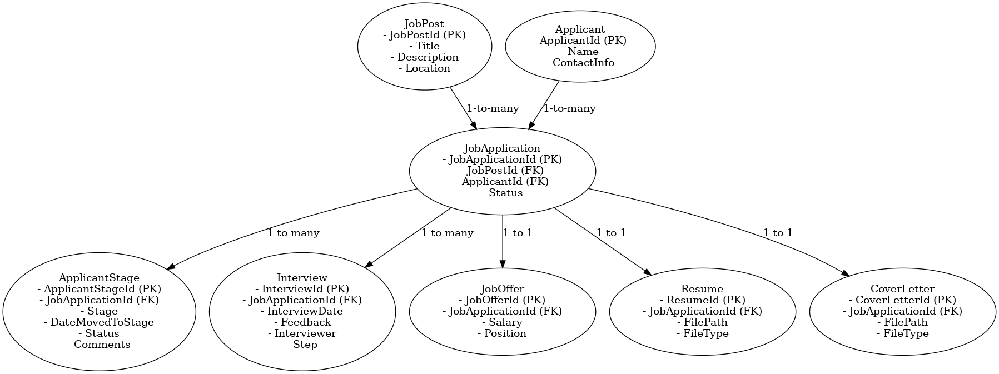
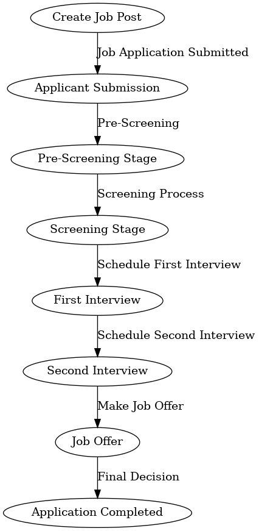

# Recruitment Module - README

## Overview
The Recruitment Module in the Human Resource Management System (HRMS) is responsible for managing the hiring lifecycle, including job postings, applicant submissions, recruitment stages, interviews, and job offers. The following classes and relationships are used to capture each aspect of recruitment effectively.

## Data Modeling
The Recruitment Module involves several entities, each playing a specific role in managing the recruitment process:

- **JobPost**: Represents details of a job post, including job title, description, and location.
- **Applicant**: Stores personal information about each applicant.
- **JobApplication**: Tracks each applicant's application for a job post, including the application status.
- **ApplicantStage**: Represents different stages of the recruitment process for an application.
- **Interview**: Captures interview details, including the date, interviewer, feedback, and the step of the interview process (e.g., 1st, 2nd).
- **JobOffer**: Represents the final job offer details, including the position offered and salary.
- **Resume**: Represents the resume file submitted by the applicant, including the file path and file type.
- **CoverLetter**: Represents the cover letter file submitted by the applicant, including the file path and file type.

### Data Modeling Classes
```csharp
public class JobPost
{
    public int JobPostId { get; set; }
    public string Title { get; set; }
    public string Description { get; set; }
    public string Location { get; set; }
    public ICollection<JobApplication> JobApplications { get; set; } = new List<JobApplication>();
}

public class Applicant
{
    public int ApplicantId { get; set; }
    public string Name { get; set; }
    public string ContactInfo { get; set; }
    public ICollection<JobApplication> JobApplications { get; set; } = new List<JobApplication>();
}

public class JobApplication
{
    public int JobApplicationId { get; set; }
    public int JobPostId { get; set; }
    public JobPost JobPost { get; set; }
    public int ApplicantId { get; set; }
    public Applicant Applicant { get; set; }
    public ApplicationStatus Status { get; set; }
    public ICollection<ApplicantStage> ApplicantStages { get; set; } = new List<ApplicantStage>();
    public ICollection<Interview> Interviews { get; set; } = new List<Interview>();
    public JobOffer JobOffer { get; set; }
    public Resume Resume { get; set; }
    public CoverLetter CoverLetter { get; set; }
}

public enum ApplicationStatus
{
    PreScreening,
    Screening,
    Interview,
    Offer
}

public class ApplicantStage
{
    public int ApplicantStageId { get; set; }
    public int JobApplicationId { get; set; }
    public JobApplication JobApplication { get; set; }
    public ApplicationStatus Stage { get; set; }
    public DateTime DateMovedToStage { get; set; }
    public string Status { get; set; }
    public string Comments { get; set; }
}

public class Interview
{
    public int InterviewId { get; set; }
    public int JobApplicationId { get; set; }
    public JobApplication JobApplication { get; set; }
    public DateTime InterviewDate { get; set; }
    public string Feedback { get; set; }
    public string Interviewer { get; set; }
    public int Step { get; set; } // Step number to indicate if it's the first, second, etc. interview
}

public class JobOffer
{
    public int JobOfferId { get; set; }
    public int JobApplicationId { get; set; }
    public JobApplication JobApplication { get; set; }
    public decimal Salary { get; set; }
    public string Position { get; set; }
}

public class Resume
{
    public int ResumeId { get; set; }
    public int JobApplicationId { get; set; }
    public JobApplication JobApplication { get; set; }
    public string FilePath { get; set; }
    public string FileType { get; set; }
}

public class CoverLetter
{
    public int CoverLetterId { get; set; }
    public int JobApplicationId { get; set; }
    public JobApplication JobApplication { get; set; }
    public string FilePath { get; set; }
    public string FileType { get; set; }
}
```

### Relationships
- A **JobPost** can have many **JobApplications**.
- An **Applicant** can submit multiple **JobApplications**.
- A **JobApplication** can go through multiple **ApplicantStages** and **Interviews**, but only one **JobOffer**.
- A **JobApplication** can have one **Resume** and one **CoverLetter**.

## Flow of the Recruitment Module
### 1. Create a Job Post
The recruitment process starts with creating a job post, which includes defining the job title, description, and location. This information is used to attract potential candidates.

**Example Data**:
```csharp
var jobPost = new JobPost
{
    JobPostId = 1,
    Title = "Software Developer",
    Description = "Responsible for developing software.",
    Location = "New York"
};
```

### 2. Applicant Submits an Application
Applicants apply for the job.

**Example Data**:
```csharp
var applicant = new Applicant
{
    ApplicantId = 1,
    Name = "John Doe",
    ContactInfo = "john.doe@example.com"
};

var jobApplication = new JobApplication
{
    JobApplicationId = 1,
    JobPostId = jobPost.JobPostId,
    JobPost = jobPost,
    ApplicantId = applicant.ApplicantId,
    Applicant = applicant,
    Status = ApplicationStatus.PreScreening
};

var resume = new Resume
{
    ResumeId = 1,
    JobApplicationId = jobApplication.JobApplicationId,
    FilePath = "/resumes/john_doe_resume.pdf",
    FileType = "PDF"
};

var coverLetter = new CoverLetter
{
    CoverLetterId = 1,
    JobApplicationId = jobApplication.JobApplicationId,
    FilePath = "/cover_letters/john_doe_cover_letter.pdf",
    FileType = "PDF"
};
```

### 3. Move Through Recruitment Stages
A **JobApplication** progresses through multiple stages of recruitment.

**Example Data**:
```csharp
var applicantStage = new ApplicantStage
{
    ApplicantStageId = 1,
    JobApplicationId = jobApplication.JobApplicationId,
    JobApplication = jobApplication,
    Stage = ApplicationStatus.Screening,
    DateMovedToStage = DateTime.Now,
    Status = "In Progress",
    Comments = "Passed pre-screening."
};
```

### 4. Conduct Interviews
If the applicant passes the screening stage, interviews are scheduled. Multiple interviews can be conducted, tracked by the `Step` property in the **Interview** entity.

**Example Data**:
```csharp
var firstInterview = new Interview
{
    InterviewId = 1,
    JobApplicationId = jobApplication.JobApplicationId,
    JobApplication = jobApplication,
    InterviewDate = new DateTime(2024, 10, 25),
    Feedback = "Strong technical knowledge.",
    Interviewer = "Jane Smith",
    Step = 1
};

var secondInterview = new Interview
{
    InterviewId = 2,
    JobApplicationId = jobApplication.JobApplicationId,
    JobApplication = jobApplication,
    InterviewDate = new DateTime(2024, 10, 28),
    Feedback = "Good team player.",
    Interviewer = "Michael Johnson",
    Step = 2
};
```

### 5. Make a Job Offer
After successfully completing all interviews, the applicant is offered the job. A **JobOffer** entity is created to represent this step.

**Example Data**:
```csharp
var jobOffer = new JobOffer
{
    JobOfferId = 1,
    JobApplicationId = jobApplication.JobApplicationId,
    Salary = 75000.00m,
    Position = "Software Developer"
};
jobApplication.Status = ApplicationStatus.Offer;
```

## Example Flow Summary
1. **Create Job Post**: A job post for a "Software Developer" is created.
2. **Applicant Submission**: John Doe submits an application for the job post, along with a resume and cover letter.
3. **Move Through Stages**: The application moves from Pre-Screening to Screening.
4. **Conduct Interviews**: Two interviews are conducted.
5. **Make Job Offer**: A job offer is extended to the applicant after successful interviews.

## ERD and Flow Diagram
### Entity Relationship Diagram (ERD)


### Recruitment Flow Diagram


These diagrams provide a visual representation of the data model and the flow of the recruitment process, helping to understand how the entities are related and how the recruitment process progresses step-by-step.

## Conclusion
This Recruitment Module helps to manage the hiring process comprehensively, capturing key details and ensuring that each phase of recruitment is efficiently handled.

