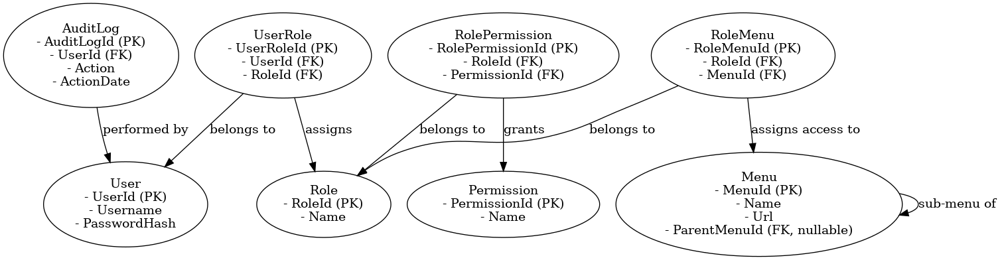
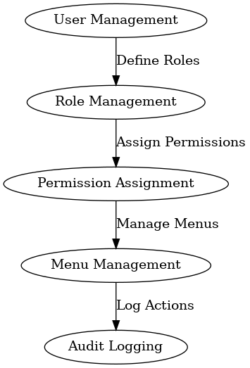

# Administration Module - README

## Overview

The Administration Module in the Human Resource Management System (HRMS) is responsible for managing user roles, permissions, menus, and tracking actions for audit purposes. This module includes functionality for role-based access control (RBAC), user management, permissions assignment, menu management, and audit logging for transparency and compliance.

## Data Modeling

The Administration Module includes the following key entities:

- **User**: Represents a user in the system, including their username and password.
- **Role**: Represents a system role, such as Admin, HR, or Employee, that determines user permissions.
- **Permission**: Represents specific actions that can be performed in the system, such as CRUD operations.
- **UserRole**: Represents the association between users and roles, allowing each user to have multiple roles.
- **RolePermission**: Represents the association between roles and permissions, allowing each role to have multiple permissions.
- **Menu**: Represents the system menus available for navigation, including their hierarchy and associated permissions.
- **RoleMenu**: Represents the association between roles and menus, determining which menus are accessible by which roles.
- **AuditLog**: Tracks changes made by users for auditing purposes, such as user actions and timestamps.

### Relationships

- A **User** can have multiple **Roles** through the **UserRole** entity.
- A **Role** can have multiple **Permissions** through the **RolePermission** entity.
- A **Role** can have multiple **Menus** through the **RoleMenu** entity.
- The **AuditLog** entity tracks actions made by a **User**.

### Data Modeling Classes

```csharp
// Administration Module
public class User
{
    public int UserId { get; set; }
    public string Username { get; set; }
    public string PasswordHash { get; set; }
    public ICollection<UserRole> UserRoles { get; set; } = new List<UserRole>();
}

public class Role
{
    public int RoleId { get; set; }
    public string Name { get; set; }
    public ICollection<RolePermission> RolePermissions { get; set; } = new List<RolePermission>();
    public ICollection<RoleMenu> RoleMenus { get; set; } = new List<RoleMenu>();
}

public class Permission
{
    public int PermissionId { get; set; }
    public string Name { get; set; }
}

public class UserRole
{
    public int UserRoleId { get; set; }
    public int UserId { get; set; }
    public User User { get; set; }
    public int RoleId { get; set; }
    public Role Role { get; set; }
}

public class RolePermission
{
    public int RolePermissionId { get; set; }
    public int RoleId { get; set; }
    public Role Role { get; set; }
    public int PermissionId { get; set; }
    public Permission Permission { get; set; }
}

public class Menu
{
    public int MenuId { get; set; }
    public string Name { get; set; }
    public string Url { get; set; }
    public int? ParentMenuId { get; set; } // Nullable to support root menus
    public Menu ParentMenu { get; set; } // Navigation property for hierarchy
    public ICollection<Menu> SubMenus { get; set; } = new List<Menu>();
}

public class RoleMenu
{
    public int RoleMenuId { get; set; }
    public int RoleId { get; set; }
    public Role Role { get; set; }
    public int MenuId { get; set; }
    public Menu Menu { get; set; }
}

public class AuditLog
{
    public int AuditLogId { get; set; }
    public int UserId { get; set; }
    public User User { get; set; }
    public string Action { get; set; }
    public DateTime ActionDate { get; set; }
}
```

## Example Scenarios

### 1. User Creation and Role Assignment
A new user is created and assigned a role. The **UserRole** entity is used to link the user to a role.

**Example Data**:

```csharp
var user = new User
{
    UserId = 1,
    Username = "john.doe",
    PasswordHash = "hashed_password"
};

var role = new Role
{
    RoleId = 1,
    Name = "Admin"
};

var userRole = new UserRole
{
    UserRoleId = 1,
    UserId = user.UserId,
    User = user,
    RoleId = role.RoleId,
    Role = role
};
```

### 2. Role Permission Assignment
Permissions are assigned to a role. The **RolePermission** entity links roles to permissions.

**Example Data**:

```csharp
var permission = new Permission
{
    PermissionId = 1,
    Name = "Create User"
};

var rolePermission = new RolePermission
{
    RolePermissionId = 1,
    RoleId = role.RoleId,
    Role = role,
    PermissionId = permission.PermissionId,
    Permission = permission
};
```

### 3. Menu Creation and Role Assignment
Menus are created and assigned to roles using the **RoleMenu** entity, determining which menus are accessible by each role.

**Example Data**:

```csharp
var menu = new Menu
{
    MenuId = 1,
    Name = "Dashboard",
    Url = "/dashboard"
};

var roleMenu = new RoleMenu
{
    RoleMenuId = 1,
    RoleId = role.RoleId,
    Role = role,
    MenuId = menu.MenuId,
    Menu = menu
};
```

### 4. Audit Logging
When a user performs an action, such as creating another user, it is logged in the **AuditLog** entity.

**Example Data**:

```csharp
var auditLog = new AuditLog
{
    AuditLogId = 1,
    UserId = user.UserId,
    User = user,
    Action = "Created new user: jane.doe",
    ActionDate = DateTime.Now
};
```

## Flow of Administration Module

1. **User Management**: Create a new user and assign appropriate roles.
2. **Role Management**: Define roles with specific permissions.
3. **Permission Assignment**: Assign permissions to roles, ensuring proper access control.
4. **Menu Management**: Define system menus and assign them to roles to control navigation access.
5. **Audit Logging**: Track and log user actions for compliance and transparency.

## ERD and Flow Diagram

### Entity Relationship Diagram (ERD)


### Administration Module Flow Diagram


These diagrams provide a visual representation of the data model and the flow of the administration processes, helping to understand how users, roles, permissions, and menus are managed.

## Conclusion

The Administration Module provides essential functionality for managing users, roles, permissions, and menus within the HRMS. By defining roles and assigning appropriate permissions and menus, the module ensures that access is properly controlled across the system. The audit logging capabilities also help track user actions, providing transparency and ensuring compliance with organizational policies.

