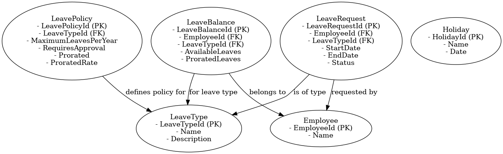
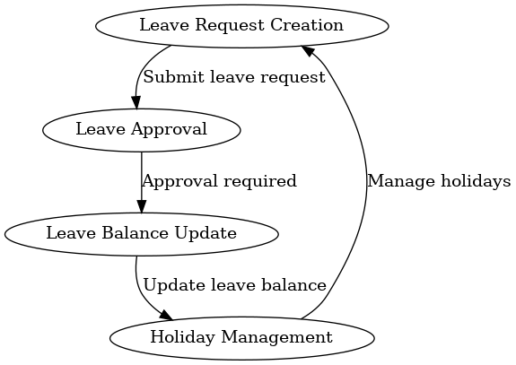

# Leave Module - README

## Overview
The Leave Module in the Human Resource Management System (HRMS) is responsible for managing employee leave requests, holiday schedules, leave balances, and leave policies. The module provides functionality to manage different types of leaves, track available leave balances, and implement policies for leave approval and prorated calculations.

## Data Modeling
The Leave Module includes the following key entities:

- **LeaveRequest**: Captures leave request details, including the type of leave, the employee requesting it, and the start and end dates.
- **Holiday**: Represents company holidays, including whether the holiday is recurring.
- **LeaveType**: Represents different types of leaves (e.g., Sick, Vacation, Unpaid).
- **LeavePolicy**: Defines leave policies for each leave type, such as maximum leaves per year, whether the leave is prorated, and whether it requires approval.
- **LeaveBalance**: Tracks the available leave balance for each employee, including prorated calculations based on employee tenure and leave policies.

### Relationships
- A **LeaveRequest** is linked to an **Employee** and a **LeaveType**.
- A **LeavePolicy** is defined for each **LeaveType** and determines the leave rules.
- A **LeaveBalance** tracks the leave available to an **Employee** for each **LeaveType**.

### Data Modeling Classes
```csharp
public class LeaveRequest
{
    public int LeaveRequestId { get; set; }
    public int EmployeeId { get; set; }
    public Employee Employee { get; set; }
    public int LeaveTypeId { get; set; }
    public LeaveType LeaveType { get; set; }
    public DateTime StartDate { get; set; }
    public DateTime EndDate { get; set; }
    public string Status { get; set; }
}

public class Holiday
{
    public int HolidayId { get; set; }
    public string Name { get; set; }
    public DateTime Date { get; set; }
}

public class LeaveType
{
    public int LeaveTypeId { get; set; }
    public string Name { get; set; }
    public string Description { get; set; }
}

public class LeavePolicy
{
    public int LeavePolicyId { get; set; }
    public int LeaveTypeId { get; set; }
    public LeaveType LeaveType { get; set; }
    public int MaximumLeavesPerYear { get; set; } // Maximum number of leaves allowed per year
    public bool RequiresApproval { get; set; } // Whether leave type requires approval
    public bool Prorated { get; set; } // Whether leave is prorated
    public decimal ProratedRate { get; set; } // Prorated rate (e.g., leaves per month)
}

public class LeaveBalance
{
    public int LeaveBalanceId { get; set; }
    public int EmployeeId { get; set; }
    public Employee Employee { get; set; }
    public int LeaveTypeId { get; set; }
    public LeaveType LeaveType { get; set; }
    public int AvailableLeaves { get; set; } // Available leave balance for the employee
    public int ProratedLeaves { get; set; } // Prorated leave balance calculated based on employee's tenure and leave policy
}
```

## ERD and Flow Diagram
### Entity Relationship Diagram (ERD)


### Leave Module Flow Diagram


These diagrams provide a visual representation of the data model and the flow of leave management processes, helping to understand how leave requests are handled, leave balances are calculated, and policies are enforced.

## Example Scenarios
### 1. Leave Request
An employee submits a leave request for a vacation. The **LeaveRequest** entity captures the details of the request, including the start and end dates, and the status of the request.

**Example Data**:
```csharp
var leaveRequest = new LeaveRequest
{
    LeaveRequestId = 1,
    EmployeeId = 1,
    LeaveTypeId = 2, // Vacation Leave
    StartDate = new DateTime(2024, 12, 1),
    EndDate = new DateTime(2024, 12, 10),
    Status = "Pending"
};
```

### 2. Leave Balance Update
An employee's leave balance is updated based on their leave requests and leave policy. The **LeaveBalance** entity maintains the leave balance for each type of leave.

**Example Data**:
```csharp
var leaveBalance = new LeaveBalance
{
    LeaveBalanceId = 1,
    EmployeeId = 1,
    LeaveTypeId = 2, // Vacation Leave
    AvailableLeaves = 10,
    ProratedLeaves = 2 // Based on prorated calculations
};
```

### 3. Holiday Management
A company holiday is recorded in the **Holiday** entity, making it easy to track non-working days.

**Example Data**:
```csharp
var holiday = new Holiday
{
    HolidayId = 1,
    Name = "New Year's Day",
    Date = new DateTime(2025, 1, 1)
};
```

## Flow of Leave Module
1. **Leave Request Creation**: Employees submit leave requests specifying leave type and duration.
2. **Leave Approval**: Depending on the **LeavePolicy**, the leave request may require approval by a manager.
3. **Leave Balance Update**: Leave balances are updated based on the leave request, applying prorated rules if necessary.
4. **Holiday Management**: Manage holidays and incorporate them into leave calculations.

## Conclusion
The Leave Module provides a robust way to manage employee leave requests, balances, and company holidays. By defining leave policies and keeping track of leave balances, the module ensures that the organization's leave management is consistent, fair, and efficient.

