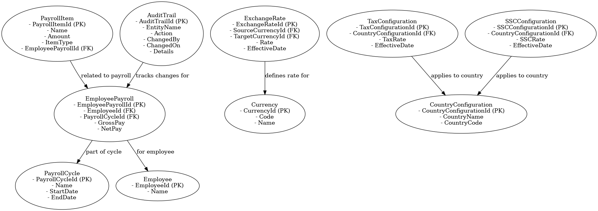
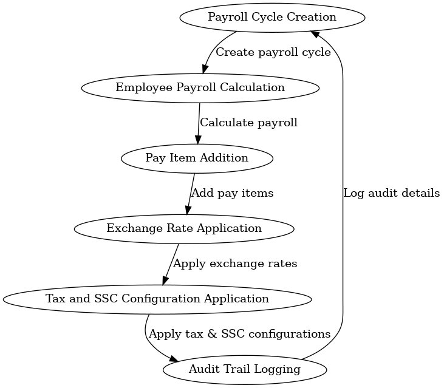

# Payroll Module - README (Updated Version)

## Overview

The Payroll Module in the Human Resource Management System (HRMS) is responsible for managing payroll cycles, calculating employee pay, managing pay items (such as bonuses, allowances, or deductions), and handling currency and exchange rates. This module also supports country-specific payroll rules, configurable tax rates, SSC (Social Security Contribution) rates, and includes auditing capabilities for enhanced financial management and compliance.

## Data Modeling

The Payroll Module includes the following key entities:

- **PayrollCycle**: Represents a payroll cycle, including start and end dates, and the list of employees paid in that cycle.
- **EmployeePayroll**: Captures payroll information for an employee, including gross pay, net pay, income tax, SSC contributions, and other payroll items.
- **PayrollItem**: Represents specific pay items such as bonuses, allowances, or deductions for an employee within a payroll cycle.
- **Currency**: Represents different currencies used for payroll, including currency codes and names.
- **ExchangeRate**: Represents exchange rates for multi-currency payroll, including the effective date for the rate.
- **TaxConfiguration**: Represents configurable tax rates applied to payroll for specific countries.
- **SSCConfiguration**: Represents configurable SSC rates applied to payroll for specific countries.
- **CountryConfiguration**: Defines country-specific payroll rules, including tax and SSC rates.
- **AuditTrail**: Tracks changes made to payroll records for auditing purposes.

### Relationships

- A **PayrollCycle** can include multiple **EmployeePayroll** records, each representing the payroll details for an employee.
- **EmployeePayroll** is linked to an **Employee** and a **PayrollCycle**.
- **PayrollItem** is linked to an **EmployeePayroll** to capture specific earnings or deductions for an employee.
- **ExchangeRate** is linked to a **Currency** to define currency conversion rates.
- **TaxConfiguration** and **SSCConfiguration** are linked to **CountryConfiguration** to apply country-specific payroll rules.
- **AuditTrail** captures changes made to payroll records for tracking purposes.

### Data Modeling Classes

```csharp
// Payroll Module
public class PayrollCycle
{
    public int PayrollCycleId { get; set; }
    public string Name { get; set; }
    public DateTime StartDate { get; set; }
    public DateTime EndDate { get; set; }
    public ICollection<EmployeePayroll> EmployeePayrolls { get; set; } = new List<EmployeePayroll>();
}

public class EmployeePayroll
{
    public int EmployeePayrollId { get; set; }
    public int EmployeeId { get; set; }
    public Employee Employee { get; set; }
    public int PayrollCycleId { get; set; }
    public PayrollCycle PayrollCycle { get; set; }
    public decimal GrossPay { get; set; }
    public decimal NetPay { get; set; }
    public decimal IncomeTax { get; set; } // Income tax amount
    public decimal SSC { get; set; } // Social security contribution
    public decimal TaxRate { get; set; } // Tax rate applied
    public decimal SSCRate { get; set; } // SSC rate applied
    public ICollection<PayrollItem> PayrollItems { get; set; } = new List<PayrollItem>();
}

public class PayrollItem
{
    public int PayrollItemId { get; set; }
    public string Name { get; set; } // e.g., Performance Bonus, Housing Allowance, Income Tax
    public decimal Amount { get; set; }
    public PayrollItemType ItemType { get; set; } // Enum to define whether it's Allowance, Deduction, Pay Item
    public int EmployeePayrollId { get; set; }
    public EmployeePayroll EmployeePayroll { get; set; }
}

public enum PayrollItemType
{
    Allowance,
    Deduction,
    PayItem
}

public class Currency
{
    public int CurrencyId { get; set; }
    public string Code { get; set; } // e.g., USD, THB
    public string Name { get; set; }
}

public class ExchangeRate
{
    public int ExchangeRateId { get; set; }
    public int SourceCurrencyId { get; set; }
    public Currency SourceCurrency { get; set; }
    public int TargetCurrencyId { get; set; }
    public Currency TargetCurrency { get; set; }
    public decimal Rate { get; set; }
    public DateTime EffectiveDate { get; set; }
}

public class CountryConfiguration
{
    public int CountryConfigurationId { get; set; }
    public string CountryName { get; set; } // e.g., United States, Thailand
    public string CountryCode { get; set; } // ISO Country Code e.g., US, TH
    public ICollection<TaxConfiguration> TaxConfigurations { get; set; } = new List<TaxConfiguration>();
    public ICollection<SSCConfiguration> SSCConfigurations { get; set; } = new List<SSCConfiguration>();
}

public class TaxConfiguration
{
    public int TaxConfigurationId { get; set; }
    public int CountryConfigurationId { get; set; } // New Foreign Key
    public CountryConfiguration CountryConfiguration { get; set; } // Navigation Property
    public decimal TaxRate { get; set; } // Tax rate (e.g., 0.06 for 6%)
    public DateTime EffectiveDate { get; set; }
}

public class SSCConfiguration
{
    public int SSCConfigurationId { get; set; }
    public int CountryConfigurationId { get; set; } // New Foreign Key
    public CountryConfiguration CountryConfiguration { get; set; } // Navigation Property
    public decimal SSCRate { get; set; } // Social Security Contribution rate (e.g., 0.04 for 4%)
    public DateTime EffectiveDate { get; set; }
}

public class AuditTrail
{
    public int AuditTrailId { get; set; }
    public string EntityName { get; set; } // e.g., EmployeePayroll, PayrollItem
    public string Action { get; set; } // e.g., Insert, Update, Delete
    public string ChangedBy { get; set; } // User who made the change
    public DateTime ChangedOn { get; set; }
    public string Details { get; set; } // Description of what changed
}
```

## ERD and Flow Diagram

### Entity Relationship Diagram (ERD)



### Payroll Module Flow Diagram



These diagrams provide a visual representation of the data model and the flow of payroll management processes, helping to understand how payroll cycles are handled, employee payrolls are calculated, and exchange rates are applied.

## Example Scenarios

### 1. Payroll Cycle Creation

A payroll cycle is created for a specific period, and employees are added to the cycle. The **PayrollCycle** entity tracks the start and end dates of the payroll period.

**Example Data**:

```csharp
var payrollCycle = new PayrollCycle
{
    PayrollCycleId = 1,
    Name = "November 2024 Payroll",
    StartDate = new DateTime(2024, 11, 1),
    EndDate = new DateTime(2024, 11, 30)
};
```

### 2. Employee Payroll Record

An employee's payroll record is created for the payroll cycle, including their gross and net pay, income tax, and SSC contributions. The **EmployeePayroll** entity captures these details.

**Example Data**:

```csharp
var employeePayroll = new EmployeePayroll
{
    EmployeePayrollId = 1,
    EmployeeId = 1,
    PayrollCycleId = payrollCycle.PayrollCycleId,
    GrossPay = 5000.00m,
    NetPay = 4500.00m,
    IncomeTax = 300.00m,
    SSC = 200.00m,
    TaxRate = 0.06m,
    SSCRate = 0.04m
};
```

### 3. Payroll Item Addition

A bonus is added to an employee's payroll as a pay item. The **PayrollItem** entity captures the specific pay item details.

**Example Data**:

```csharp
var payItem = new PayrollItem
{
    PayrollItemId = 1,
    Name = "Performance Bonus",
    Amount = 500.00m,
    ItemType = PayrollItemType.PayItem,
    EmployeePayrollId = employeePayroll.EmployeePayrollId
};
```

### 4. Allowance Addition

An employee receives a housing allowance. The **PayrollItem** entity captures the specific allowance details.

**Example Data**:

```csharp
var allowance = new PayrollItem
{
    PayrollItemId = 2,
    Name = "Housing Allowance",
    Amount = 300.00m,
    ItemType = PayrollItemType.Allowance,
    EmployeePayrollId = employeePayroll.EmployeePayrollId
};
```

### 5. Deduction Addition

A deduction for income tax is added to an employee's payroll. The **PayrollItem** entity captures the specific deduction details.

**Example Data**:

```csharp
var deduction = new PayrollItem
{
    PayrollItemId = 3,
    Name = "Income Tax",
    Amount = 300.00m,
    ItemType = PayrollItemType.Deduction,
    EmployeePayrollId = employeePayroll.EmployeePayrollId
};
```

### 6. Tax Configuration

Tax configurations are created to apply specific tax rates to payroll calculations for a given country. The **TaxConfiguration** entity captures these details.

**Example Data**:

```csharp
var taxConfig = new TaxConfiguration
{
    TaxConfigurationId = 1,
    CountryConfigurationId = 1, // United States
    TaxRate = 0.10m, // 10% tax rate
    EffectiveDate = new DateTime(2024, 1, 1)
};
```

### 7. SSC Configuration

SSC configurations are created to apply specific SSC rates to payroll calculations for a given country. The **SSCConfiguration** entity captures these details.

**Example Data**:

```csharp
var sscConfig = new SSCConfiguration
{
    SSCConfigurationId = 1,
    CountryConfigurationId = 2, // Thailand
    SSCRate = 0.04m, // 4% SSC rate
    EffectiveDate = new DateTime(2024, 1, 1)
};
```

### 8. Audit Trail Logging

When changes are made to payroll records, they are logged in the **AuditTrail** entity for tracking purposes.

**Example Data**:

```csharp
var auditTrail = new AuditTrail
{
    AuditTrailId = 1,
    EntityName = "EmployeePayroll",
    Action = "Update",
    ChangedBy = "AdminUser",
    ChangedOn = DateTime.Now,
    Details = "Updated GrossPay from 5000.00 to 5500.00"
};
```

## Payroll Calculation Formula

The payroll calculation involves determining the **gross pay**, **deductions**, and ultimately the **net pay** for each employee.

### Payroll Calculation Formula:

1. **Gross Pay** = Base Salary + Allowances + Pay Items
2. **Deductions** = Income Tax + Social Security Contribution (SSC) + Other Deductions
3. **Net Pay** = Gross Pay - Deductions

### Example Calculation

- **Base Salary**: \$5000.00
- **Allowances**:
  - Housing Allowance: \$300.00
- **Pay Items**:
  - Performance Bonus: \$500.00
- **Deductions**:
  - Income Tax: \$300.00
  - SSC (Social Security Contribution): \$200.00

#### Gross Pay Calculation:

\[
	ext{Gross Pay} = 5000.00 + 300.00 + 500.00 = 5800.00
\]

#### Deductions Calculation:

\[
	ext{Deductions} = 300.00 + 200.00 = 500.00
\]

#### Net Pay Calculation:

\[
	ext{Net Pay} = 5800.00 - 500.00 = 5300.00
\]

So, the **Net Pay** for the employee in this payroll cycle would be **\$5300.00**.

## Flow of Payroll Module

1. **Payroll Cycle Creation**: Define the payroll cycle with start and end dates.
2. **Employee Payroll Calculation**: Calculate gross and net pay for each employee within the payroll cycle, including income tax and SSC contributions.
3. **Payroll Item Addition**: Add specific pay items (e.g., bonuses or allowances) to employee payroll records.
4. **Exchange Rate Application**: Apply exchange rates for multi-currency payroll if applicable.
5. **Tax and SSC Configuration Application**: Apply tax and SSC configurations to payroll calculations.
6. **Audit Trail Logging**: Log any changes made to payroll records for auditing purposes.

## Conclusion

The Payroll Module provides a comprehensive way to manage payroll cycles, calculate employee salaries, handle pay items, allowances, deductions, and manage currency and exchange rates. The addition of country-specific configurations ensures that payroll processing is adaptable to different regions, making it suitable for companies operating in multiple countries. By defining payroll cycles and keeping track of pay details, the module ensures that payroll processing is accurate, efficient, and compliant with financial policies.

