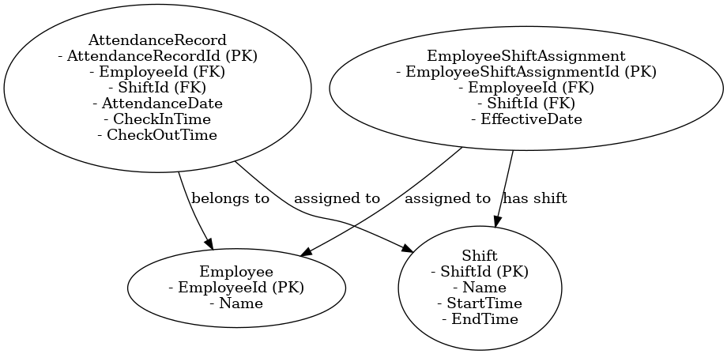
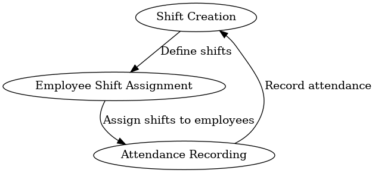

# Attendance Module - README

## Overview
The Attendance Module in the Human Resource Management System (HRMS) is responsible for managing employee attendance records, shifts, and shift assignments. The module ensures accurate tracking of employee working hours, shifts, and attendance, which are essential for payroll and operational efficiency.

## Data Modeling
The Attendance Module includes the following key entities:

- **AttendanceRecord**: Captures attendance details for an employee, including check-in and check-out times for a specific date and shift.
- **Shift**: Represents different shifts within the company, including shift start and end times.
- **EmployeeShiftAssignment**: Manages the assignment of employees to shifts, including the effective date of the assignment.

### Relationships
- An **AttendanceRecord** is linked to an **Employee** and a **Shift**.
- A **Shift** can have multiple **AttendanceRecords** and can be assigned to multiple employees.
- **EmployeeShiftAssignment** manages the relationship between **Employees** and **Shifts**, specifying which shift an employee is assigned to and when the assignment is effective.

### Data Modeling Classes
```csharp
public class AttendanceRecord
{
    public int AttendanceRecordId { get; set; }
    public int EmployeeId { get; set; }
    public Employee Employee { get; set; }
    public int ShiftId { get; set; } // Link attendance to a specific shift
    public Shift Shift { get; set; } // Navigation property for shift details
    public DateTime AttendanceDate { get; set; } // Date of the attendance
    public DateTime CheckInTime { get; set; }
    public DateTime? CheckOutTime { get; set; }
}

public class Shift
{
    public int ShiftId { get; set; }
    public string Name { get; set; }
    public TimeSpan StartTime { get; set; }
    public TimeSpan EndTime { get; set; }
}

public class EmployeeShiftAssignment
{
    public int EmployeeShiftAssignmentId { get; set; }
    public int EmployeeId { get; set; }
    public Employee Employee { get; set; }
    public int ShiftId { get; set; }
    public Shift Shift { get; set; }
    public DateTime EffectiveDate { get; set; } // Date when the shift assignment is effective
}
```

## ERD and Flow Diagram
### Entity Relationship Diagram (ERD)


### Attendance Module Flow Diagram


These diagrams provide a visual representation of the data model and the flow of attendance management processes, helping to understand how the entities are related and how attendance data is captured and utilized.

## Example Scenarios
### 1. Employee Shift Assignment
An employee is assigned to a morning shift, and the assignment becomes effective from a specific date. The **EmployeeShiftAssignment** entity records this relationship.

**Example Data**:
```csharp
var shift = new Shift
{
    ShiftId = 1,
    Name = "Morning Shift",
    StartTime = new TimeSpan(9, 0, 0),
    EndTime = new TimeSpan(17, 0, 0)
};

var employeeShiftAssignment = new EmployeeShiftAssignment
{
    EmployeeShiftAssignmentId = 1,
    EmployeeId = 1,
    ShiftId = shift.ShiftId,
    EffectiveDate = new DateTime(2024, 11, 1)
};
```

### 2. Employee Attendance Recording
An employee checks in and checks out for their assigned shift. The **AttendanceRecord** entity stores the attendance details, including the check-in and check-out times.

**Example Data**:
```csharp
var attendanceRecord = new AttendanceRecord
{
    AttendanceRecordId = 1,
    EmployeeId = 1,
    ShiftId = 1,
    AttendanceDate = new DateTime(2024, 11, 2),
    CheckInTime = new DateTime(2024, 11, 2, 9, 0, 0),
    CheckOutTime = new DateTime(2024, 11, 2, 17, 0, 0)
};
```

### 3. Multi-Shift Example
An employee works multiple shifts in a day. The **AttendanceRecord** entity captures multiple records for the same date, each linked to a different shift.

**Example Data**:
```csharp
var morningShift = new Shift
{
    ShiftId = 1,
    Name = "Morning Shift",
    StartTime = new TimeSpan(9, 0, 0),
    EndTime = new TimeSpan(13, 0, 0)
};

var eveningShift = new Shift
{
    ShiftId = 2,
    Name = "Evening Shift",
    StartTime = new TimeSpan(14, 0, 0),
    EndTime = new TimeSpan(18, 0, 0)
};

var morningAttendance = new AttendanceRecord
{
    AttendanceRecordId = 2,
    EmployeeId = 1,
    ShiftId = morningShift.ShiftId,
    AttendanceDate = new DateTime(2024, 11, 3),
    CheckInTime = new DateTime(2024, 11, 3, 9, 0, 0),
    CheckOutTime = new DateTime(2024, 11, 3, 13, 0, 0)
};

var eveningAttendance = new AttendanceRecord
{
    AttendanceRecordId = 3,
    EmployeeId = 1,
    ShiftId = eveningShift.ShiftId,
    AttendanceDate = new DateTime(2024, 11, 3),
    CheckInTime = new DateTime(2024, 11, 3, 14, 0, 0),
    CheckOutTime = new DateTime(2024, 11, 3, 18, 0, 0)
};
```

## Flow of Attendance Module
1. **Shift Creation**: Define shifts such as morning, evening, or night.
2. **Employee Shift Assignment**: Assign an employee to a specific shift with an effective date.
3. **Attendance Recording**: Record employee attendance, including check-in and check-out times for each shift. Multiple shifts can be recorded for the same employee on the same day.

## Conclusion
The Attendance Module provides a comprehensive way to manage employee shifts and track attendance records, ensuring accurate and efficient handling of employee working hours. This information is crucial for payroll processing and monitoring employee productivity.

