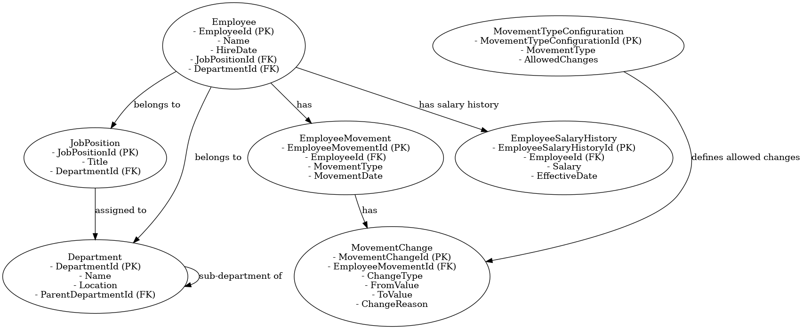
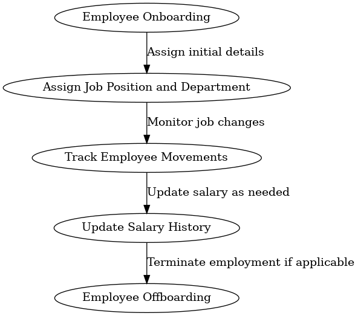

# Employee Module - README

## Overview
The Employee Module in the Human Resource Management System (HRMS) is responsible for managing employee information, roles, departments, salary history, and the movements (transfers, promotions, etc.) of employees within the company. The module ensures efficient handling of employee lifecycle within the organization.

## Data Modeling
The Employee Module includes the following key entities:

- **Employee**: Stores the primary details of an employee, including their name, hire date, department, and job position.
- **JobPosition**: Represents different positions within the company, such as title and associated department.
- **Department**: Represents company departments, which can be structured hierarchically.
- **EmployeeMovement**: Tracks employee movements, such as promotions, transfers, or changes in department.
- **MovementChange**: Stores specific changes (e.g., department or job position) associated with an employee movement.
- **EmployeeSalaryHistory**: Maintains records of changes in an employee's salary over time.
- **MovementTypeConfiguration**: Specifies the allowed changes for each type of employee movement.

### Relationships
- An **Employee** is assigned a **JobPosition** and belongs to a **Department**.
- A **JobPosition** belongs to a **Department** and can be held by multiple **Employees**.
- A **Department** can have sub-departments, creating a hierarchical structure, and can have multiple **Employees**.
- An **Employee** can have multiple **EmployeeMovements**, which track promotions, transfers, and more.
- Each **EmployeeMovement** can have multiple **MovementChanges** that describe specific changes made (e.g., department, job position, salary).
- An **Employee** can have multiple **EmployeeSalaryHistory** records, representing changes in their salary over time.
- **MovementTypeConfiguration** specifies the allowed changes for each type of movement, providing flexibility in defining movement rules.

## ERD and Flow Diagram
### Entity Relationship Diagram (ERD)


### Employee Module Flow Diagram


These diagrams provide a visual representation of the data model and the flow of employee management processes, helping to understand how the entities are related and how the employee lifecycle progresses step-by-step.

## Example Scenarios
### 1. Employee Promotion
An employee is promoted from "Junior Developer" to "Senior Developer" and moved from one department to another. The **EmployeeMovement** entity records this promotion, and multiple **MovementChanges** entities track the specific changes in **JobPosition** and **Department**.

**Example Data**:
```csharp
var employee = new Employee
{
    EmployeeId = 1,
    Name = "John Doe",
    HireDate = new DateTime(2021, 6, 15),
    JobPositionId = 1,
    DepartmentId = 1
};

var promotionMovement = new EmployeeMovement
{
    EmployeeMovementId = 1,
    EmployeeId = employee.EmployeeId,
    MovementType = MovementType.Promotion,
    MovementDate = new DateTime(2023, 8, 1),
    Comments = "Promoted to Senior Developer"
};

var jobPositionChange = new MovementChange
{
    MovementChangeId = 1,
    EmployeeMovementId = promotionMovement.EmployeeMovementId,
    ChangeType = ChangeType.JobPosition,
    FromValue = "Junior Developer",
    ToValue = "Senior Developer",
    ChangeReason = "Performance and experience"
};

var departmentChange = new MovementChange
{
    MovementChangeId = 2,
    EmployeeMovementId = promotionMovement.EmployeeMovementId,
    ChangeType = ChangeType.Department,
    FromValue = "Development",
    ToValue = "Advanced Development",
    ChangeReason = "Department restructuring"
};
```

### 2. Salary Update
When an employee's salary changes, a new record is added to **EmployeeSalaryHistory**, storing the new salary amount and the effective date.

**Example Data**:
```csharp
var salaryHistory = new EmployeeSalaryHistory
{
    EmployeeSalaryHistoryId = 1,
    EmployeeId = employee.EmployeeId,
    Salary = 90000.00m,
    EffectiveDate = new DateTime(2023, 8, 1)
};
```

## Conclusion
The Employee Module provides a comprehensive way to manage employee details, track their movements within the organization, and maintain historical records of their salary changes and other key events. This helps ensure that employee data is always up-to-date and accessible for both day-to-day operations and long-term strategic planning.

